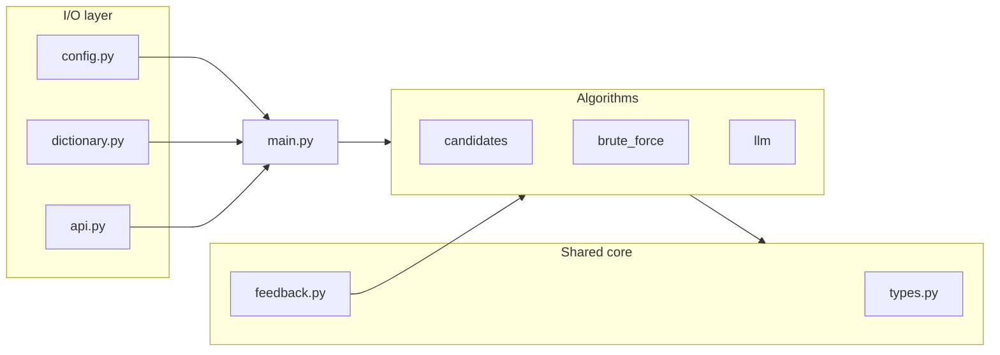
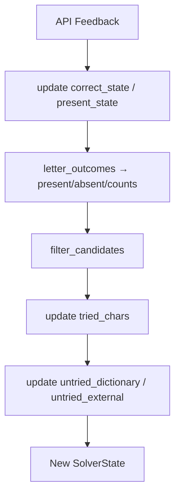

# Architecture

## Overview

The solver is split into **I/O** (config, HTTP, dictionary load) and **pure logic** (state updates, filtering, guess selection). Algorithms share the same `SolverState` and `Feedback` types but implement different `next_guess` strategies.

## Main loop

[`solver/main.py`](../../solver/main.py) runs:

1. Load config and dictionary.
2. `state = algorithm.initial_state(word_length, dictionary)`
3. Repeat up to `max_guesses`:
   - `guess = algorithm.next_guess(state)`
   - `raw = client.guess(guess)`
   - `feedback = parse_feedback(raw)`
   - If `is_solved(feedback)` → print guess, exit 0
   - `state = algorithm.apply_feedback(state, feedback)`
4. Exit 1 if max guesses exceeded.

Algorithms implement the `Algorithm` protocol in [`solver/algorithms/__init__.py`](../../solver/algorithms/__init__.py):

- `initial_state(n, dictionary) -> SolverState`
- `apply_feedback(state, feedback) -> SolverState`
- `next_guess(state) -> str`

## SolverState

Immutable snapshot of everything learned so far ([`solver/types.py`](../../solver/types.py)):

| Field | Type | Role |
|-------|------|------|
| `word_length` | `int` | Puzzle length `N` |
| `present_chars` | `frozenset[str]` | Letters confirmed in the answer (`correct` + `present`) |
| `absent_chars` | `frozenset[str]` | Letters confirmed **not** in the answer |
| `untried_dictionary_chars` | `frozenset[str]` | In candidate alphabet, not tried, not classified |
| `untried_external_chars` | `frozenset[str]` | In `a-z` but not in candidate alphabet, not tried, not classified |
| `present_state` | `tuple[frozenset[str], ...]` | Per slot: letters in the word but **not** at this index |
| `correct_state` | `tuple[str \| None, ...]` | Per slot: confirmed letter or `None` |
| `min_counts` | `Mapping[str, int]` | Minimum occurrences per letter (duplicates) |
| `max_counts` | `Mapping[str, int]` | Maximum occurrences per letter |
| `tried_chars` | `frozenset[str]` | Letters already sent in a guess |
| `candidates` | `tuple[str, ...]` | Dictionary words still consistent with constraints |

Initial values (candidates algorithm):

- `present_chars`, `absent_chars`, `tried_chars` → empty
- `correct_state` → all `None`
- `present_state` → all empty sets
- `candidates` → dictionary words of length `N`
- `untried_dictionary_chars` → letters appearing in `candidates`
- `untried_external_chars` → `a-z` minus those letters

## Feedback pipeline

After each API response, state is updated in a **fixed order** (`apply_feedback`):

1. **Position updates** — `update_correct_state`, `update_present_state`
2. **Letter classification** — `letter_outcomes`, merge into `present_chars`, `absent_chars`, `min_counts`, `max_counts`
3. **Candidate filter** — drop words that violate any constraint
4. **Untried sets** — refresh from new candidates and tried/classified letters

## Candidates algorithm

Primary path when `WORDLE_ALGORITHM=candidates`.

### Guess selection

| `len(candidates)` | Action |
|-------------------|--------|
| `> 2` | `build_probe_guess` — information-gain string (not necessarily a dictionary word) |
| `1` or `2` | `select_candidate_guess` — pick best remaining dictionary word |
| `0` | `next_fallback_guess` — brute-force probes (dictionary miss) |

### Probe strategy (`candidates > 2`)

Fill `N` slots using letters in priority order:

1. `untried_dictionary_chars` into slots ordered by `position_priority` (known-correct slots first, then present slots, then rest)
2. Remaining holes: `present_chars` that do not appear in every candidate (`chars_not_universal`)
3. Remaining holes: other `present_chars`
4. Remaining holes: `untried_external_chars`
5. Pad with repeatable present letters if needed

Purpose: maximize information to split the candidate set quickly.

Detailed design: [../../docs/algorithms/candidtes.md](../../docs/algorithms/candidtes.md).

## Brute-force algorithm

`WORDLE_ALGORITHM=brute_force` ignores the dictionary for guessing:

1. **Charset probe** — test `N` unused letters at once to discover which letters appear in the word.
2. **Position probe** — fill unknown slots with one known letter, keeping already-correct slots (`iieiiiii` after `e` is locked, not `iiiiiiii`).

`apply_feedback` reuses the candidates pipeline so `present_chars`, `correct_state`, and untried sets stay consistent. `next_guess` always calls `next_fallback_guess`.

Details: [../../docs/algorithms/brute-force.md](../../docs/algorithms/brute-force.md).

## LLM algorithm

`WORDLE_ALGORITHM=llm` builds a prompt from guess history (`build_prompt`, `format_history`) and parses `<guess>WORD</guess>` from the model response (`extract_guess`).

The CLI driver does not wire an LLM client yet; `next_guess` requires a `complete(prompt)` callback. State updates still use the candidates `apply_feedback` / `initial_state`.

Prompt template: [../../docs/algorithms/llm-promt.md](../../docs/algorithms/llm-promt.md).

## Module map

| Module | Responsibility |
|--------|----------------|
| `solver/types.py` | `SolverState`, `Feedback`, `alphabet`, empty state helpers |
| `solver/feedback.py` | `parse_feedback`, `is_solved`, position and letter updates |
| `solver/algorithms/candidates/filter.py` | Constraint matchers, `filter_candidates` |
| `solver/algorithms/candidates/untried.py` | Candidate alphabet, untried char sets |
| `solver/algorithms/candidates/state.py` | `initial_state`, `apply_feedback`, `filter_by_length` |
| `solver/algorithms/candidates/guess.py` | Probe and candidate guess builders, `next_guess` |
| `solver/algorithms/brute_force/probes.py` | Charset/position probes, `next_fallback_guess` |
| `solver/algorithms/llm/prompt.py` | Prompt template, history formatting, guess extraction |

## Design principles

- **Pure functions** for all constraint logic: no mutation, easy to test.
- **Immutable state** — each `apply_feedback` returns a new `SolverState`.
- **Guesses need not be dictionary words** when probing (overwrite known-correct slots to test new letters).
- **TDD** — tests in `tests/` define expected behavior before implementations land.

Function-level reference: [FUNCTIONS.md](FUNCTIONS.md).
